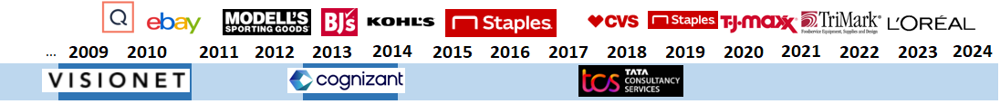

# Career Timeline

Project details are on [Linkedin](https://linkedin.com/in/mdeevan)

Clients/Customers

Employers

# Portfolio of Projects - public repository

1.  [Arvato Financial Customer Segmentation - Unsupervised learning  (2024)]() 
    
       _Work with real-life data provided to Udacity by Bertelsmann partners AZ Direct and Arvato Finance Solution. 
              The data here concerns a company that performs mail-order sales in Germany. 
              Their main question of interest is to identify facets of the population that are most likely to be purchasers of their products for a mailout campaign._
1.  [Image Classification  (2024)](https://github.com/mdeevan/CIFAR-10_Image_Classifier/)

    _CIFAR-10 Image Classification using PyTorch_

1.  [Finding Donors for CharityML  (2024)](https://github.com/mdeevan/Finding-Donors-for-CharityML)
            
    _Identify Donors for chartiy based on the Census data, employing supervised machine learning algorithms_

1.  [Personalized Realestate Agent  (2024)](https://github.com/mdeevan/Personalized-Real-Estate-Agent)
    
    _Generate synthetic real estate data, and then provide personalized listing recommendation based on user provided preferences via interactive prompts_

1.  [Custom Chatbot  (2024)](https://github.com/mdeevan/custom_chatbot)

    _Custom chatbot to answer question about TV Series Survior. Uses web-scrapting to capture data from web for RAG, uses Chroma_

1.  [LLM Finetuning  (2024)](https://github.com/mdeevan/LightweightFineTuning)

    _Lightweight finetuning of bert-large-uncased LLM with qLoRA_

1.  [Starbucks (2021)](https://github.com/mdeevan/StarbucksCapstone)
    _Identify starbucks demographics groups  that best response to discount offers based on transaction, demographic and offer data._

1.  [Airbnb - Boston (2021)](https://github.com/mdeevan/DataScienceBlogPost)
    _Analyze publically available dataset (boston airbnb) to understand data and domain._

1.  [Disaster Response Pipeline  (2021)](https://github.com/mdeevan/DisasterResponsePipeline)
    _Natural language processing and machine learning to classify the text and tweets sent during such disasters_

###  C++

1.  [Find shortest path (A* Algorithm implementation)  (2024)](https://github.com/mdeevan/CppND-Route-Planning-Project)

    _Route planner that plots a path between two points on a map using real map data from the <a href="https://www.openstreetmap.org/">OpenStreeMap project</a>_

* * *
# Education/Qualification

### Degrees

1.  Masters in Computer Science
1.  Masters in Business Administration - Marketing

### Udacity Nanodegree/Certifications

1.  [Introduction to Machine Learning with PyTorch](https://www.udacity.com/certificate/e/a55f5dd6-7cd1-11ef-a364-abd10f867587)
1.  [Generative AI](https://www.udacity.com/certificate/e/e09168e0-b61b-11ee-a72a-7f749cd4e37d)
1.  [Data Scientist](https://www.udacity.com/certificate/H4DWUZJL)
1.  [Data Science for Business Leaders](https://www.udacity.com/certificate/3CYG6DHU)

